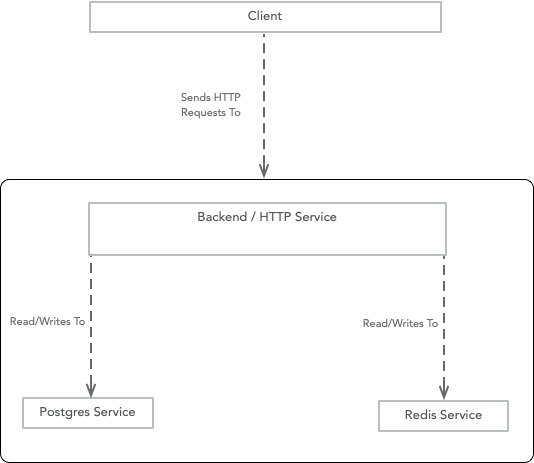

# Demo - GitOps in action using Kubernetes With Argo CD, vCluster, and GitHub Actions

## Introduction
This repository contains a architecture for a scalable and secure 3-tier Node application with proper GitOps practices in-place.

**High-level Components**:
1. `Backend`: A simple Node.js application that serves APIs
2. `Frontend`: A simple React application that serves HTML files and communicates with backend APIs to get required data
3. `Database`: Postgres is used
4. `Redis`: to cache backend data

## Running Demo
http://abd8a590dfbe6423c840dbae0760cc3c-2127572997.us-west-2.elb.amazonaws.com

## Architecture

High Level Architecture Diagram

**NOTE**
- HPA is enabled on Backend and Frontend Applications
- (optional) Multi-region EKS clusters could be used to support wide geographies
 
## Local Setup & Testing

Refer to this [README.md](application/README.md) for details related to the codebase and local setup

## Infra Setup and Initial Deployment

Refer to this [README.md](docs/initial-setup.md) for details related to infra setup and deployment

## CI-CD

### Tools/Services used:
- Cloud: [AWS](https://aws.amazon.com/)
- Container Registry: [Dockerhub](https://hub.docker.com/)
- CI/CD Tools: [Github Action](https://github.com/features/actions) and [ArgoCD](https://argo-cd.readthedocs.io/en/stable/)

### Required Github Secrets:
- `DOCKER_USER`: username for dockerhub
- `DOCKER_PASSWORD`: password for dockerhub - used to upload docker images
- `DOCKER_REGISTRY`: name of docker registry
- `AWS_ACCESS_KEY_ID`: Key Id with access to sandbox cluster in which ephemeral environment should be deployed
- `AWS_SECRET_ACCESS_KEY`: Secret Key with access to sandbox cluster in which ephemeral environment should be deployed
- `EKS_CLUSTER_NAME`: AWS EKS sandbox cluster name 

### Production deployment

#### Pipeline Design

- **Prod Deployment Pipeline**: `.github/workflows/prod-release.yaml` generates new dockerimage, push to dockerhub and updates image tag in values.yaml

**NOTE**: Make sure "AutoSync" is enabled in ArgoCD for these application project

### Ephemeral deployment

#### Pipeline Design

#### Infra Architecture Design

**NOTES**:
- self-managed deployments for `Postgres` and `Redis` have been used to save cost
- [vCluster](https://www.vcluster.com/) has been used to provide light-weight isolated environment that can be used to deploy short-lived ephemeral environments.

- **Deploy Ephemeral Environment**: `.github/workflows/pr-open.yaml` generates new dockerimage, push to dockerhub and deploys ephemeral environment. This github action is triggered whenever a PR against main branch has been created or updated. This pipeline outputs the URL to ephemeral deployment in the PR comment.

- **Destroy Ephemeral Environment**: `.github/workflows/pr-close.yaml` destroys ephemeral environment. This github action is triggered whenever a PR against main branch has been merged or closed.

## TODO / Future Improvements
- Support https in endpoints
- Support to serve frontend app from a static storage and CDN 
- Setup multiple replicas of Backend application in different nodes/zones for HA
- Add support for mTLS between frontend and backend
- Support to add CI/CD for IaC (Terraform)
- Integrate WAF 
